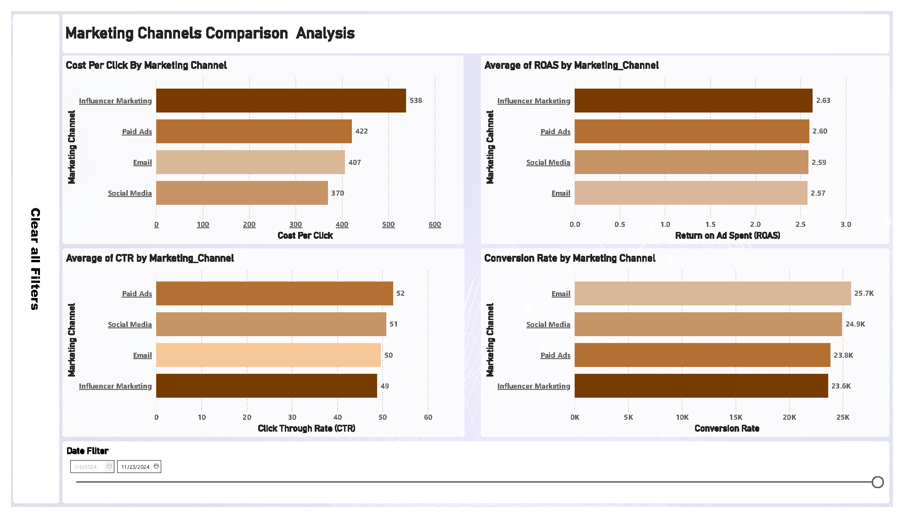
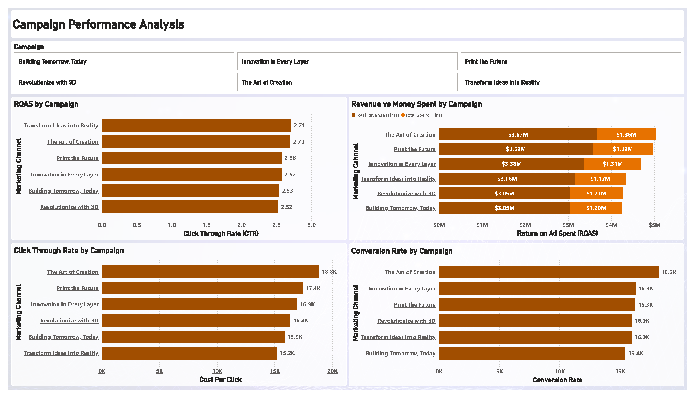
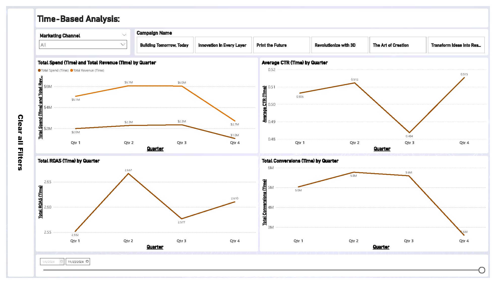
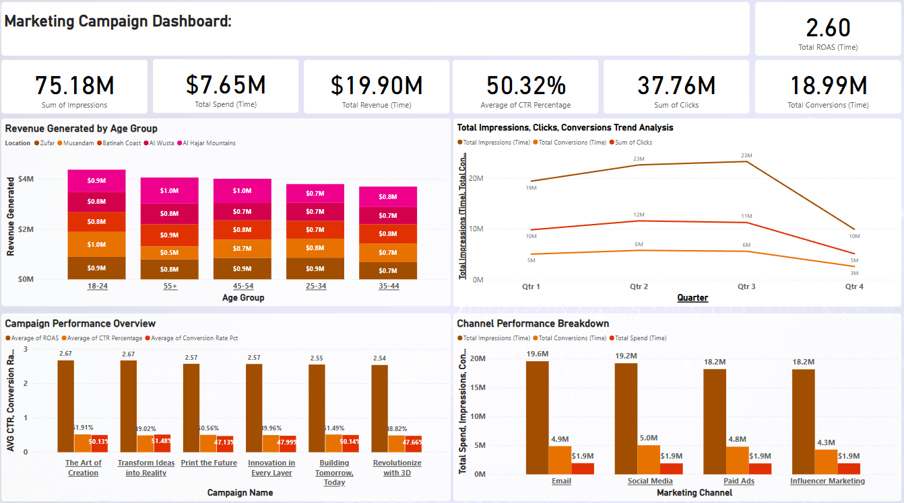

# Marketing Campaign Performance Analysis

## Project Overview

This project involved a comprehensive performance analysis of marketing campaigns for an e-commerce client. The goal was to evaluate campaign effectiveness, optimize future marketing strategies, and provide budget allocation recommendations.

## Analysis Objectives

* Calculate key marketing metrics: Conversion Rate, CPC, CPA, and ROAS.
* Compare campaign performance across marketing channels.
* Analyze campaign performance by demographics.
* Track campaign performance over time.

## Data Preparation

* The client provided a dataset with marketing campaign data.
* Due to client confidentiality, the original dataset and Power BI dashboard are not included in this repository.
* Anonymized or sample data was used for the Python scripts.
* Data types were verified and adjusted as needed.

## Tools and Technologies

* **Python (Pandas):** For data processing and metric calculation (using anonymized/sample data).

## Code and Measures

### Python (Pandas)

```python
import pandas as pd

# Load anonymized/sample data
df = pd.read_csv("anonymized_campaign_data.csv") 

# Calculate metrics
df['CTR'] = (df['Clicks'] / df['Impressions']) * 100
df['Conversion_Rate'] = (df['Conversions'] / df['Clicks']) * 100
df['CPC'] = df['Total_Spend'] / df['Clicks']
df['CPA'] = df['Total_Spend'] / df['Conversions']
df['ROAS'] = df['Revenue_Generated'] / df['Total_Spend']

# Export the processed data
df.to_csv("campaign_metrics.csv", index=False)
```

## Dashboard Report Images

- **Marketing Channels Comparison Analysis:**
    - 
    - Image of the report page comparing campaign performance across different channels.
- **Campaign Performance Analysis:**
    - 
    - Image of the report page visualizing campaign performance.
- **Time Based Analysis:**
    - 
    - Image of the report page displaying trends over time.
- **Marketing Campaign Dashboard:**
    - 
    - Image of the main dashboard page, displaying key performance indicators.

## Key Insights

- Identified top-performing campaigns and channels.
- Determined responsive demographic segments.
- Identified seasonal patterns.
- Provided budget allocation recommendations.

## Deliverables

- Example python script used for data transformation (`scripts/campaign_analysis.py` - with anonymized/sample data loading).
- Screenshots of the dashboard reports (`images/`).
- Technical Documentation (`documentation/documentation.md`).
